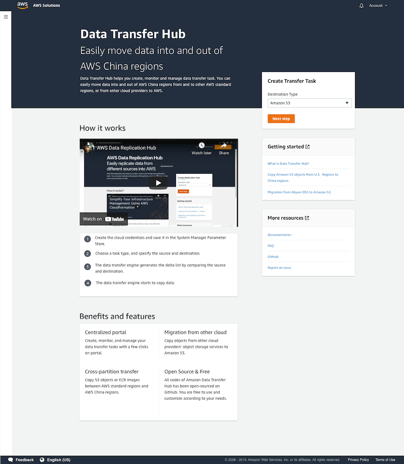
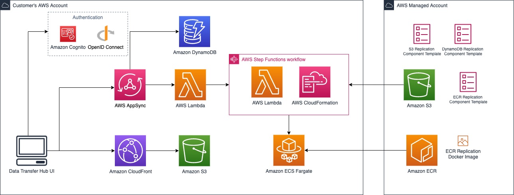

# Data Transfer Hub

_Note_: If you have already deployed this solution and looking for how to use this solution. Please refer to
the [User Guide](docs/UserManual.md).

Data Transfer Hub is a secure, reliable, scalable, and trackable solution offers a unified user experience that 
allows you to easily create and manage different types of data transfer tasks from different sources to 
Amazon Web Services cloud-native services. You can launch this solution and start to replicate data within a few minutes.

With Data Transfer Hub, you can perform any of the following tasks:
* Copy Amazon S3 objects between AWS commercial regions and AWS China regions.
* Copy data from other cloud providers’ object storage services (incl. Alibaba Cloud OSS, Tencent COS, Qiniu Kodo, Google GCS) to Amazon S3. 
* Transfer Amazon ECR images between AWS commercial regions and AWS China regions. 
* Transfer Dockers image from public docker registry (e.g. Docker Hub, Google gcr.io, Red Hat Quay.io) to Amazon ECR.

## Features

- [x] Authentication (Cognito User Pool, OIDC)
- [x] Self-service User Interface
- [x] CDK Deployment
- [x] CloudFormation Deployment
- [x] S3 Plugin
    - [x] Amazon S3 object copy between AWS standard regions and AWS China regions
    - [x] Data transfer from Alibaba Cloud OSS to Amazon S3
    - [x] Data transfer from Tencent COS to Amazon S3
    - [x] Data transfer from Qiniu Kodo to Amazon S3
    - [x] Data transfer from Google Cloud Storage to Amazon S3 (Global)
    - [ ] Data transfer from Huawei Cloud OBS
    - [x] Support data transfer with Metadata
    - [x] Support S3 Events to trigger data transfer
    - [x] [BBR](https://www.techrepublic.com/article/how-to-enable-tcp-bbr-to-improve-network-speed-on-linux/) enabled.
- [x] ECR Plugin
    - [x] Amazon ECR images copy between AWS standard regions and AWS China regions
    - [x] Public docker registry to AWS ECR images copy
    - [ ] Private docker registry to AWS ECR images copy
    - [x] Copy all images or only selected Images
    - [x] Support One-time images copy
    - [x] Support Incremental images copy
- [ ] DynamoDB Plugin

## Architecture

A web portal will be launched in the customer's AWS account. Through the web portal, customers can create data transfer 
tasks and manage them in a centralized place. When the user create a data transfer task through the web portal, the backend
will invoke the CloudFormation API to deploy another stack to provision all resources to start data transfer. The solution 
only provision resources when needed. You can also choose to deploy the data transfer plugin independently. 

Available Plugins:
* [S3 Plugin](https://github.com/awslabs/amazon-s3-data-replication-hub-plugin)
* [ECR Plugin](https://github.com/awslabs/amazon-ecr-data-replication-hub-plugin)

## Solution Deployment

> **Time to deploy:** Approximately 15 minutes.

Refer to this [guide](docs/DeployInChinaWithAuthing_EN.md) if you want deploy this solution in AWS China regions.

### Launch CloudFormation Stack

Follow the step-by-step instructions to configure and deploy the Data Transfer Hub into your account.

1. Make sure you have sign in AWS Console already.
1. Click the following button to launch the CloudFormation Stack in your account.

    
1. Input **AdminEmail** parameter. An email containing the temporary password will be sent to this email. You need to 
   this email to 
1. Click **Next** and select **Create Stack**.

### Login into the Data Replication Hub Portal

An email containing the temporary password will be sent to the provided email. Copy and paste it somewhere.

1. Open the CloudFormation Console, and choose the deployed stack.
1. Select the **Output** of the CloudFormation stack, and find the **PortalUrl**.
1. Open the portal in browser, it will be navigated to a login page. 
1. Sign in with the **AdminEmail**, and the temporary password.
1. You will be asked to set a new password.
1. You will also be asked to verify your email address in order to turn on account recovery. You can skip if you need.
1. The page will be redirected to the login page. 
1. Input the **AdminEmail** and the new password.

## User Manual

Now, you are all set. Start to create your first data transfer task. For the completed user guide, please visit
[User Guide](docs/UserManual.md) for more information.

## FAQ

**Q. Which are the supported regions of this solution?** 
You can deploy this solution in these regions: N.Virginia (us-east-1), Ohio (us-east-2), N.California (us-west-1), 
Oregon (us-west-2), Mumbai (ap-south-1), Seoul (ap-northeast-2), Singapore (ap-southeast-1), Sydney (ap-southeast-2),
Tokyo (ap-northeast-1), Canada (ca-central-1), Frankfurt (eu-central-1), Ireland (eu-west-1), London (eu-west-2), 
Paris (eu-west-3), Stockholm (eu-north-1), São Paulo (sa-east-1), Beijing (cn-north-1), Ningxia (cn-northwest-1).

**Q. If I want to copy data from U.S. regions to China regions, where should I deploy the solution?** 
You can either deploy the solution in U.S. regions or deploy the solution in China regions. 

**Q. Can I deploy the solution in AWS Account A, and transfer Amazon S3 objects from Account B to Account C?** 
Yes. In this case, you will need to store the [AccessKeyID and SecretAccessKey](https://docs.aws.amazon.com/general/latest/gr/aws-sec-cred-types.html#access-keys-and-secret-access-keys) 
for Account B and C in the [Parameter Store](https://docs.aws.amazon.com/systems-manager/latest/userguide/systems-manager-parameter-store.html) 
of Account C.

## More Resources

* [How to customize this solution and build your own distributable?](./docs/build-your-own-distributable.md)
* [Deploy this solution via AWS CDK](./docs/deploy-via-cdk.md)