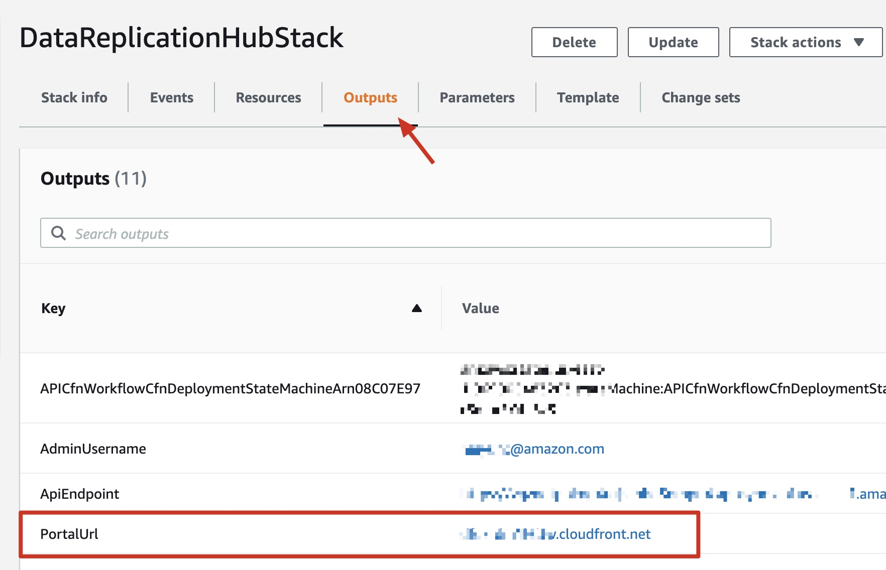
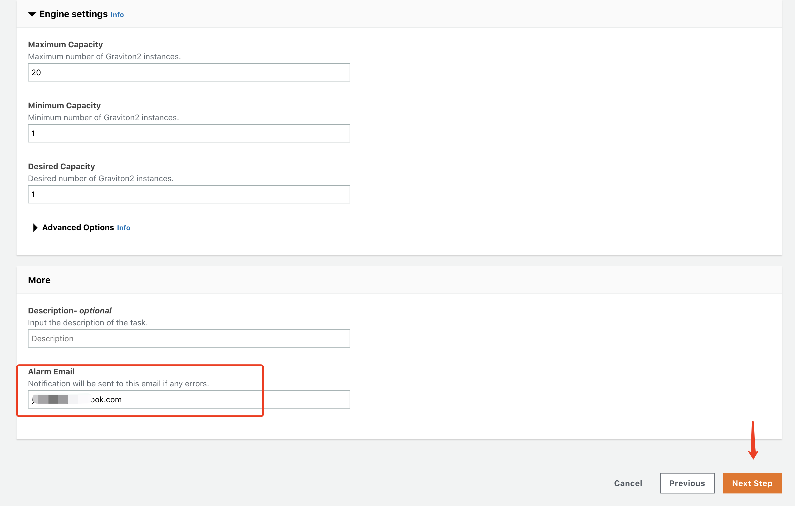

# Transfer Amazon S3 Objects from Beijing to Oregon

[中文](./tutortial-beijing-to-oregon-s3_CN.md)

This tutortial is the guide to transfer Amazon S3 Objects from **Beijing (cn-north-1)** to **Oregon (us-west-2)**. 

We assume that you have already finished the deployment of the Data Transfer Hub Solution. And the solution is deployed in **Oregon (us-west-2)** region. 

You can refer to [Deployment Guide](../README.md) to deploy the solution first.

## Login to Data Transfer Hub Portal
Once the cloudformation stack is created successfully, you will receive an email notification that contains a temporary password for login, the username is the AdminEmail you set while you launch the cloudformation.
The portal url can be found in the outputs tab of the cloudformation stack, see below screenshot as an example:



### To login the portal.

1. Open the portal URL in your browser
2. Sign in with your username and the temporary password
3. Change the temporary password
4. Verify the email (optional)


## Configure Credentials
1. Open **[Secrets Manager](https://console.aws.amazon.com/secretsmanager/home#)** console
1. Choose **Secrets** in the left navigation bar
1. Click **Store a new secret** button
1. Select **Other type of secrets** as type
1. Input the credentials as text in **Plaintext**, the credentials format should follow
    ```
    {
      "access_key_id": "<Your Access Key ID>",
      "secret_access_key": "<Your Access Key Secret>"
    }
    ```
1. Click **Next**
1. Input **Secret name**, for example: `drh-credentials`
1. Click **Next**
1. Select **Disable automatic rotation**
1. Click **Store**

## Create Replication Task from Web Portal
1. Go back to Data Transfer Hub portal, choose Amazon S3 and click **Next Step**.


2. In Edition type we recommened `EC2 Graviton 2`, then click **Next Step**.


3. In **Source settings** part, enter the name of source bucket Name and other config item. 


4. In **Destination settings** part, enter the name of destination bucket Name and other config item.


5. Enter the alarm email and click **Next Step**


6. After reviewing task, click **Create Task**. Then, you can see the task you created.


## Monitoring via Cloudwatch Dashboard

Click the CloudWatch link under the task to monitor the task. Note that when the task is created for the first time, the monitoring data of the CloudWatch may be delayed by about 5 minutes.

