# Migration from Alibaba Cloud OSS to Amazon S3
This tutortial is the guide to transfer Objects from **AlibabaCloud OSS** to **Amazon S3**. 

We assume that you have already finished the deployment of the Data Transfer Hub Solution. And the solution is deployed in **Oregon (us-west-2)** region. 

You can refer to [Deployment Guide](../README.md) to deploy the solution first.

## Login to Data Transfer Hub Portal
Once the cloudformation stack is created successfully, you will receive an email notification that contains a temporary password for login, the username is the AdminEmail you set while you launch the cloudformation.
The portal url can be found in the outputs tab of the cloudformation stack, see below screenshot as an example:


### To login the portal.

1. Open the portal URL in your browser
2. Sign in with your username and the temporary password
3. Change the temporary password
4. Verify the email (optional)


## Configure Credentials
1. Open **[Systems Manager](https://us-west-2.console.aws.amazon.com/systems-manager/home?region=us-west-2#)** console
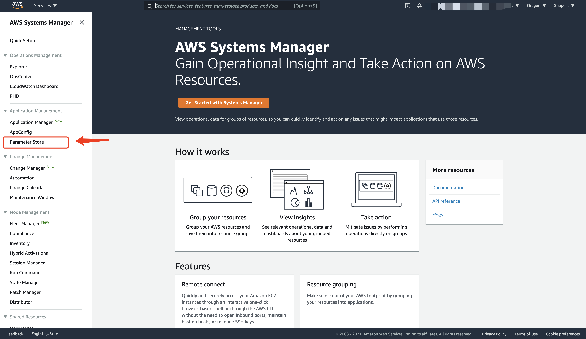
2. Choose **Parameter Store** in the left navigation bar
3. Click **Create parameter** button

4. Input a **Name**, for example: `oss-credentials`
5. select **SecureString** as type
6. Input the **credentials of AlibabaCloud** as text in **Value**, the credentials format should follow
```
{
  "access_key_id": "<Your Access Key ID>",
  "secret_access_key": "<Your Access Key Secret>"
}
```
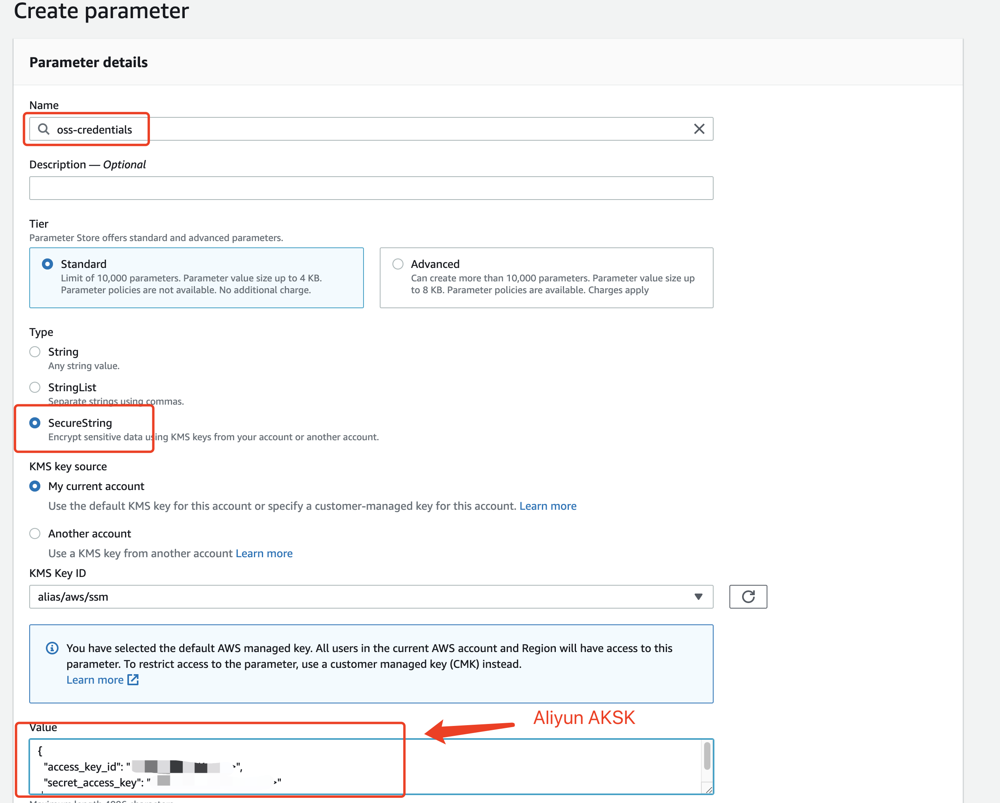

## Create Replication Task from Web Portal
1. Go back to Data Transfer Hub portal, choose Amazon S3 and click **Next Step**.
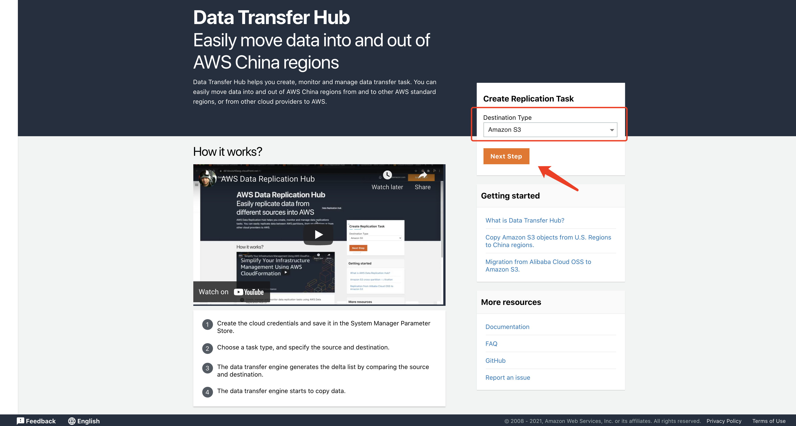

2. In Edition type we recommened `EC2 Graviton 2`, then click **Next Step**.


3. In **Source settings** part, enter the name of source bucket Name and other config item. 


4. In **Destination settings** part, enter the name of destination bucket Name and other config item.
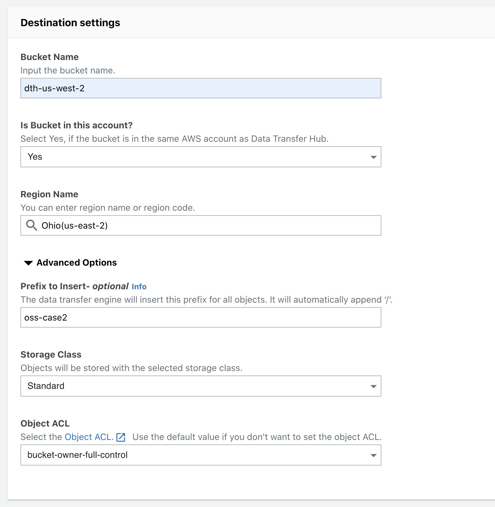

5. Enter the alarm email and click **Next Step**


6. After reviewing task, click **Create Task**. Then, you can see the task you created.


## Monitoring via Cloudwatch Dashboard


## Real time data transfer by OSS Event Triger

If you want to do real time data clone from AlibabaCloud OSS to Amazon S3. This is a guide of how to enable OSS event to trigger the replication. 

### Prerequisites
Data Transfer Hub must be deployed in AWS account, in this guide we assume that you deployed in the **us-west-2** region.

After you started the task, go to [SQS console](https://us-west-2.console.aws.amazon.com/sqs/v2/home?region=us-west-2#/queues) and write down the `Queue URL` and `Queue arn`, you will use them in the next steps. 


### Prepare your AWS account's AK/SK
Go to [IAM console](https://console.aws.amazon.com/iam/home?region=us-west-2), create a new policy.

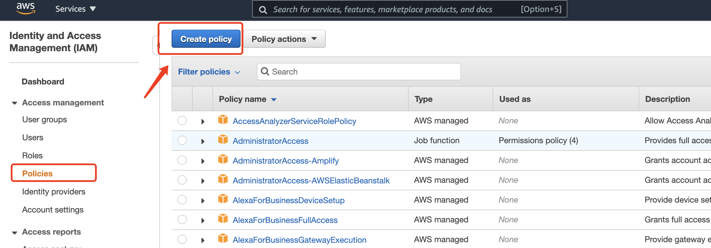

Click the **JSON**

**Remember replace your Queue arn in the JSON.**

```json
{
    "Version": "2012-10-17",
    "Statement": [
        {
            "Effect": "Allow",
            "Action": [
                "sqs:SendMessageBatch",
                "sqs:SendMessage"
            ],
            "Resource": "arn:aws:sqs:us-west-2:xxxxxxxxxxx:DTHS3Stack-S3TransferQueue-1TSF4ESFQEFKJ"
        }
    ]
}
```

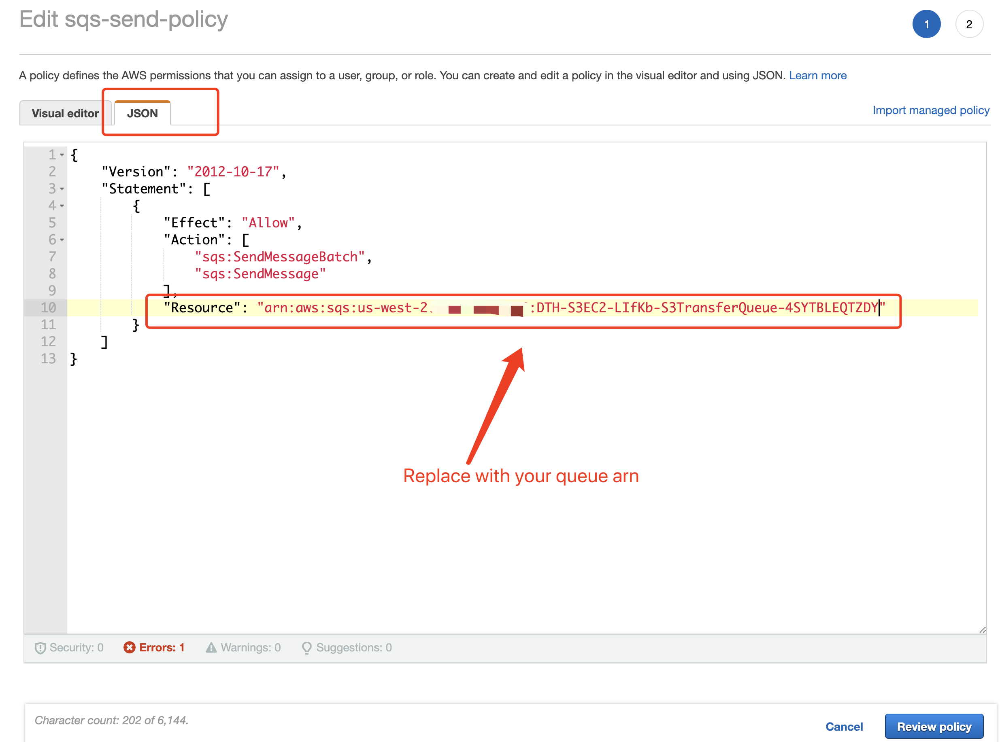

Then create the user. Go to [User](https://console.aws.amazon.com/iam/home?region=us-west-2#/users) page and click **Add User**. 

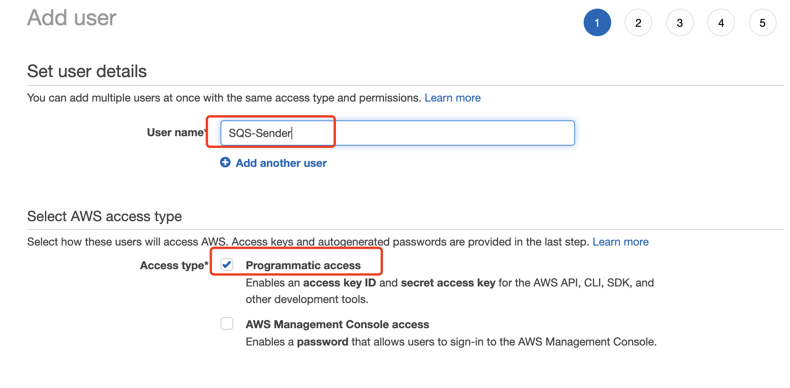

And then attach the policy you create previously to the User.  


Save the **AK/SK**, you will use them in the next steps.


### Prepare the sender function for Alibaba Cloud

Open the terminal and enter the command, suggest using docker or linux machine.

```shell
mkdir tmp
cd tmp
pip3 install -t . boto3
```
Create a index.py in the same folder, and enter the code

```python
import json
import logging
import os
import boto3


def handler(event, context):
    logger = logging.getLogger()
    logger.setLevel('INFO')

    evt = json.loads(event)

    if 'events' in evt and len(evt['events']) == 1:
        evt = evt['events'][0]

        logger.info('Got event {}'.format(evt['eventName']))
        obj = evt['oss']['object']
        # logger.info(obj)

        ak = os.environ['ACCESS_KEY']
        sk = os.environ['SECRET_KEY']
        queue_url = os.environ['QUEUE_URL']
        region_name = os.environ['REGION_NAME']

        # minimum info of a message
        obj_msg = {
            'key': obj['key'],
            'size': obj['size']
        }

        # start sending the msg
        sqs = boto3.client('sqs', region_name=region_name,
                           aws_access_key_id=ak, aws_secret_access_key=sk)

        try:
            sqs.send_message(
                QueueUrl=queue_url,
                MessageBody=json.dumps(obj_msg)
            )
        except Exception as e:
            logger.error(
                'Unable to send the message to Amazon SQS, Exception:', e)

    else:
        logger.warning('Unknown Message '+evt)

    return 'Done'
```

Zip the code (including boto3)
```shell
zip -r code.zip *
```
### Create a Function in Alibaba Cloud

Go to console of [函数计算/Function Compute](https://fc.console.aliyun.com/fc/overview/), click **新建函数/create function**


Use the code.zip to create the function.

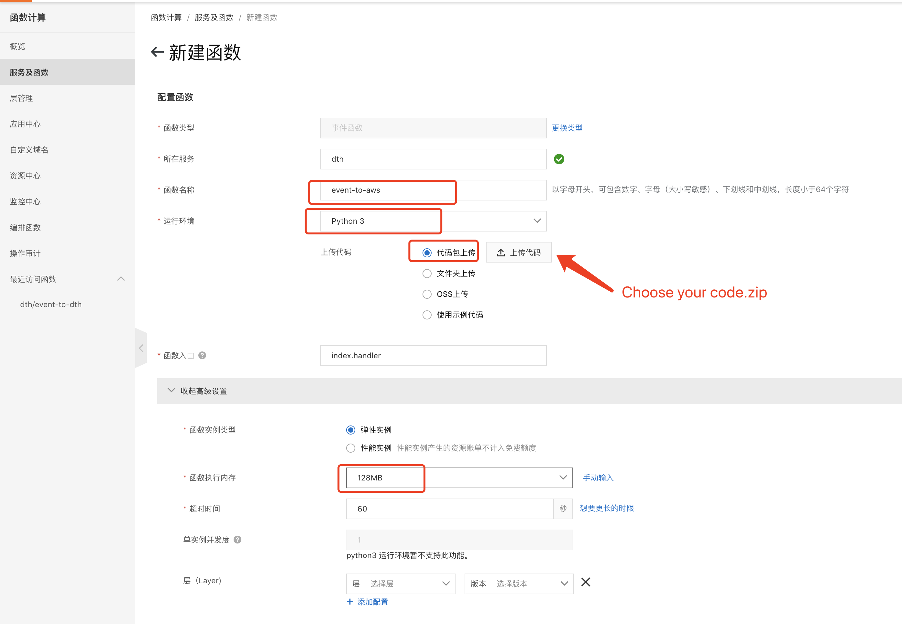

Then click **新建/create**

### Config the function's Environment Variables
Click the **修改配置/Edit Config**

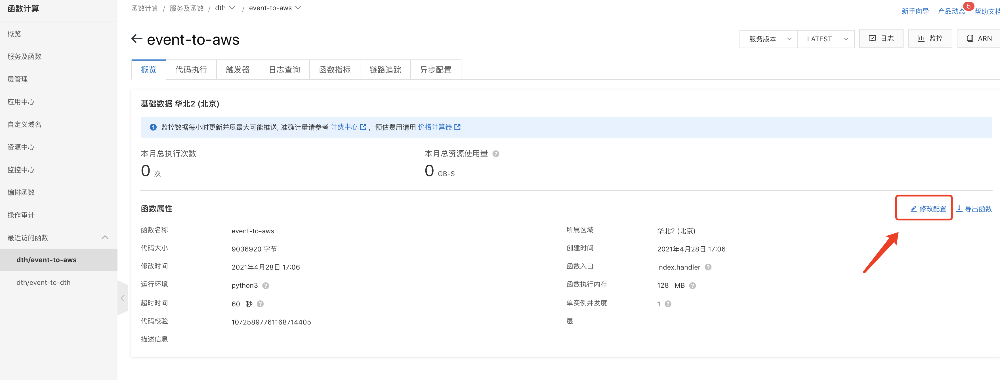

Then enter the config json in the **环境变量/Environment Variables**, remember to use your owen `ACCESS_KEY`, `SECRET_KEY` and `QUEUE_URL`.

```json
{
    "ACCESS_KEY": "XXX",
    "QUEUE_URL": "https://sqs.us-west-2.amazonaws.com/xxxx/DTHS3Stack-S3TransferQueue-xxxx",
    "REGION_NAME": "us-west-2",
    "SECRET_KEY": "XXXXX"
}
```
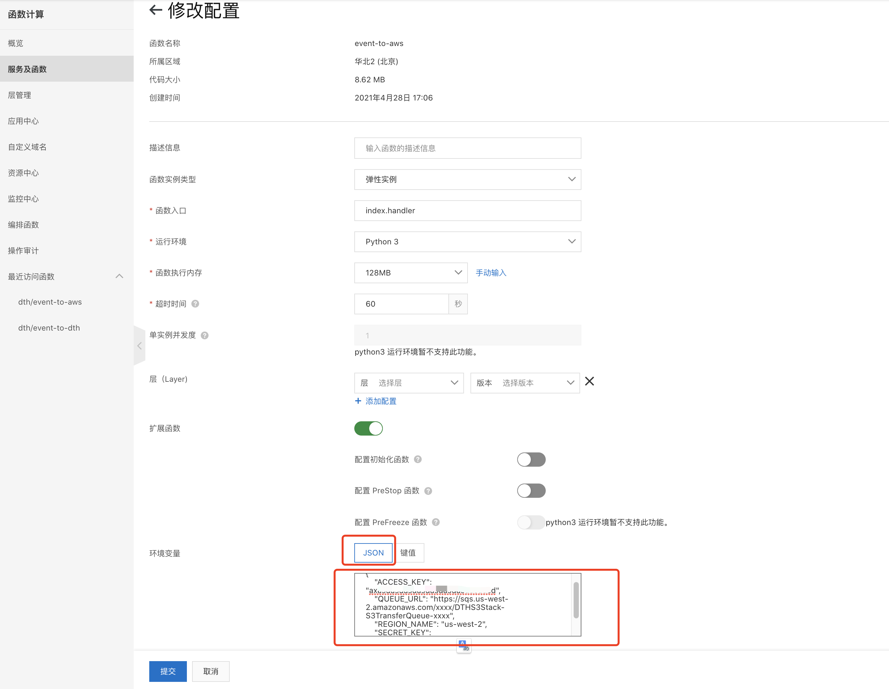

### Create  the trigger

Click the **创建触发器/create trigger** to create the trigger for the function.

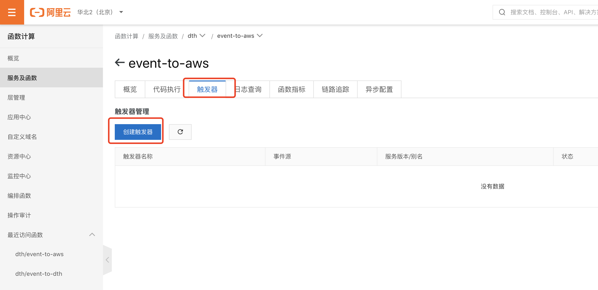

Then config the trigger as the picture show below.

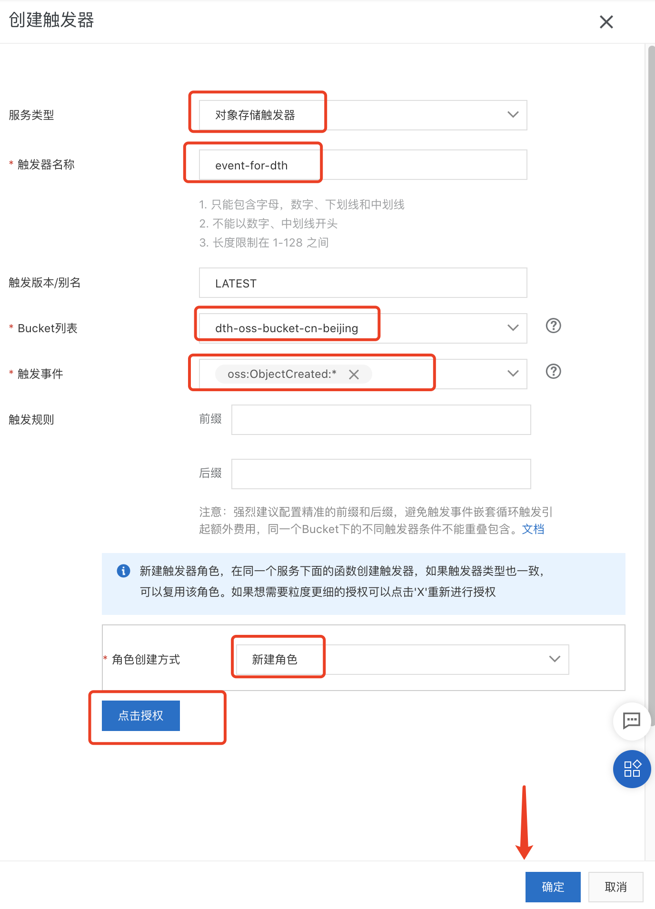